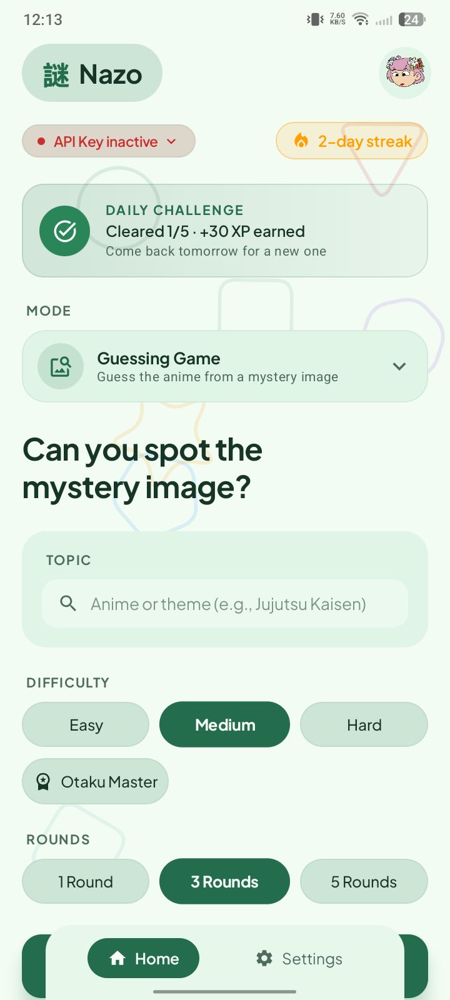
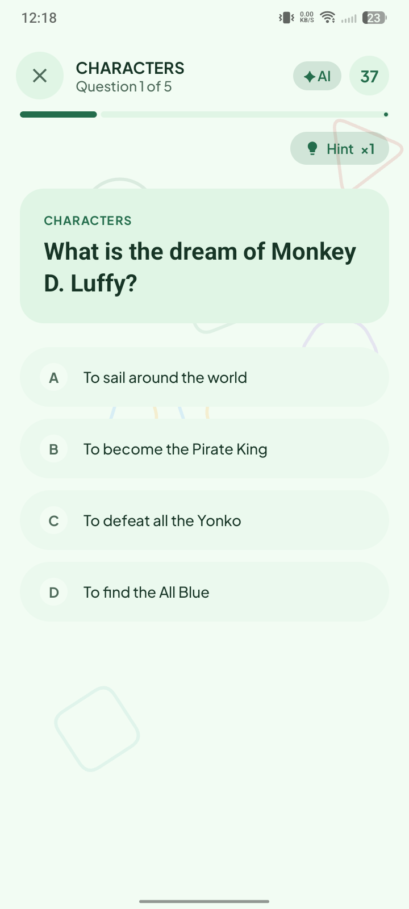
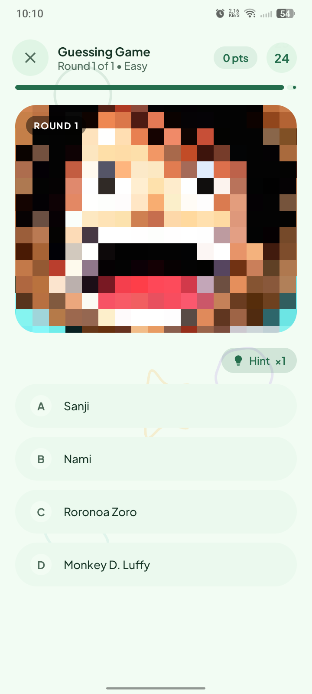
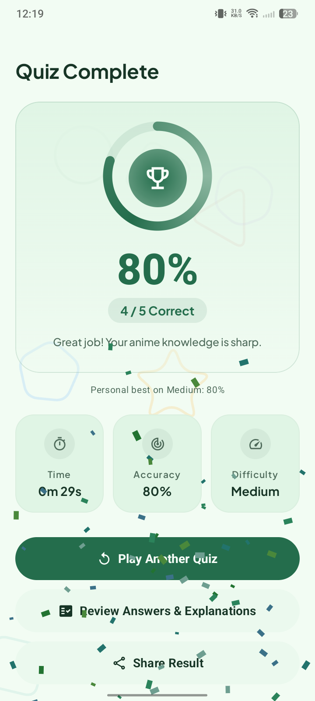
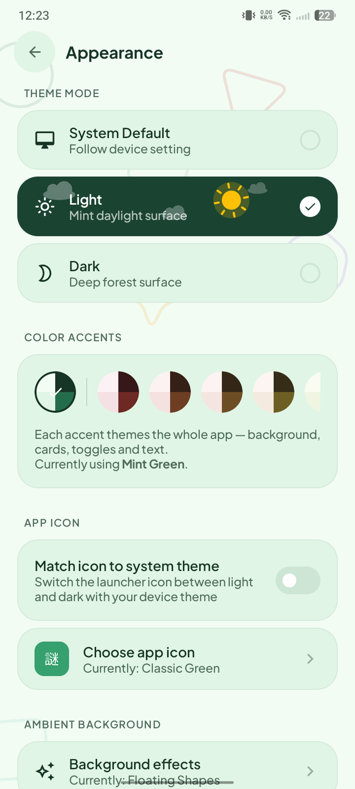

<p align="center">
  
</p>

<h1 align="center">Nazo</h1>

<p align="center">
  
  
  
  
  
  
  
  
</p>

## What is Nazo?

**Nazo** (謎, "mystery") is an Android quiz game for anime fans. Five game modes,
four difficulty tiers — **Easy**, **Medium**, **Hard**, and the brutal
**Otaku Master** — a daily challenge, records to chase, and AI-generated
question sets from a provider of your choice. Fully offline-capable, fully
themable, no account, no ads.

## 📱 Screenshots

<!--
  Drop PNGs into assets/screenshots/ with these names, then remove this
  comment to reveal the grid:

| Home | Quiz | Survival | Blitz |
|:---:|:---:|:---:|:---:|
|  |  |  |  |

| Versus | Guessing Game | Results | Appearance |
|:---:|:---:|:---:|:---:|
|  |  |  |  |
-->

*Screenshots coming soon.*

## Features

### 🎮 Five game modes

- 🎯 **Quiz** — pick a topic, difficulty and length; AI-generated questions online,
  a huge local question bank offline. Per-difficulty countdown timers, hints,
  explanations, and a full answer review.
- 🖼️ **Guessing Game** — race the countdown to un-blur a mystery image:
  4-choice answers (Easy/Medium) or fuzzy auto-complete (Hard/Otaku Master),
  with time-decay scoring and elimination when the timer hits zero.
- 🔥 **Survival** — endless questions, 3 lives. Fresh batches load in the
  background (AI when available, local bank otherwise) so a run never starves.
  Chase your longest-run record.
- ⏱️ **Blitz** — 60 seconds on one global clock, answer as many as you can.
  Auto-advancing questions, works fully offline, most-in-60s record.
- 🤝 **Versus** — pass & play on one phone: Player 1 plays, hands off (score kept
  secret), Player 2 answers the same questions re-shuffled. Head-to-head results
  with a swipeable per-player answer review.

### 🧠 Smarter quizzing

- ⚡ **Daily Challenge** — a date-seeded mixed quiz every day, works offline, bonus XP.
- 🔁 **Question anti-repeat** — recently answered questions are remembered across
  launches, sent to the AI as an avoid-list and filtered from local picks.
- 📚 **Practice deck** — questions you miss build a personal deck; replay them from
  Home, and a later correct answer graduates them out.
- 🛟 **Model fallback** — if AI generation fails, Nazo automatically retries with the
  provider's next model before giving up.
- 🏆 **Records & stats** — per-difficulty personal bests, survival/blitz records,
  achievements, XP levels and long-term statistics with a home-screen widget.

### 🎨 Look & feel

- 🎨 **15 whole-app color accents** (Mint, Crimson, Orange, Bronze, Gold, Lime, Teal,
  Slate, Indigo, Sapphire, Violet, Magenta, Pink, Rose, Mono) that recolor
  background, cards, toggles and text — each with light & dark palettes.
- 🎉 **5 victory confetti styles** (plus None), each with its own sound cue, derived
  from your accent color.
- 🌫️ **Ambient backgrounds** — switchable animated background styles that drift
  behind every screen.
- 🌓 **Launcher icon follows the system theme**; Material You aware.
- 📳 **Haptic feedback** and a full set of tiny sound cues (both toggleable).
- 🚀 **Guided onboarding** — feature tour, provider setup, appearance picker and a
  jump-straight-in first game for every mode.

### 🔧 Quality of life

- 📴 **Offline mode** — every mode except the Guessing Game works without a connection.
- 🤖 **AI Provider screen** — plug in Google Gemini, OpenRouter or OpenCode Zen
  (free-model filtering included) to generate fresh question sets.
- 📤 **Share cards** — render your results as a themed PNG and share it anywhere.
- 💾 **Backup & restore** — every store (stats, records, practice deck, question
  history, theme, providers) into one JSON file, manual or automatic.
- 🔄 **In-app updates** — checks GitHub Releases on your schedule; updates download
  inside the app with a live progress bar (MB + %), version comparison and
  one-tap install. A "What's new" sheet appears once after each update.
- ⏰ **Daily reminders** and a **streak flame** that burns hotter the longer you keep it.

## How it works

1. **Quiz flow** — `HomeScreen` → mode dropdown → topic/difficulty/length →
   `ActiveQuizScreen` runs the timed round → `QuizCompleteScreen` summarizes →
   `ReviewAnswersScreen` shows every answer; `StatisticsScreen` tracks long-term
   performance. Survival/Blitz/Versus reuse the same quiz screen with mode
   flags (lives, global clock, player badges).
2. **Guessing Game flow** — topic + rounds → `modes/guessing_game/GuessingPlayScreen`:
   the AI picks a target, an image is fetched keylessly (Wikimedia Commons →
   Wikipedia, placeholder fallback) and un-blurs as the timer runs.
3. **Quiz engine** — `data/QuizEngine.kt` + `LocalQuestionBank.kt` own the
   difficulty→behavior rules and serve questions; `data/QuizStats.kt` persists
   aggregate stats as a JSON blob in SharedPreferences (no database needed).
4. **Theming** — a single `NazoColors` palette drives the whole UI.
   `ui/theme/Color.kt` defines the palette plus the `Accents` registry;
   `NazoTheme` resolves the selected accent into a full light+dark palette and
   every screen reads colors through `NazoXxx` accessors, so changing the accent
   re-themes the app instantly.
5. **Updates** — `data/UpdateScheduler` + `UpdateCheckWorker` (WorkManager)
   periodically check GitHub Releases; the About screen's update sheet streams
   the APK in-app via `UpdateDownloader.downloadApk` with live progress, then
   hands off to the system installer (`REQUEST_INSTALL_PACKAGES`).
6. **App icon theming** — `LauncherLight` / `LauncherDark` activity-aliases are
   toggled based on the device theme so the home-screen icon matches.

## Development

### Prerequisites

- **JDK 17**
- **Android SDK** (the project compiles against `compileSdk = 36`, `minSdk = 26`, `targetSdk = 34`)
- The Gradle wrapper is included, so no separate Gradle install is needed.

### Build from source

```bash
# 1. Clone the repository
git clone https://github.com/ThatOn3Gu7/Nazo.git
cd Nazo

# 2. Make the Gradle wrapper executable
chmod +x gradlew

# 3. Assemble
./gradlew assembleDebug       # -> app/build/outputs/apk/debug/app-debug.apk
./gradlew assembleRelease     # -> app/build/outputs/apk/release/app-release.apk
```

### Signing releases

Local release builds can be signed by configuring a `signingConfig` in
`app/build.gradle.kts`, or you can rely on CI: pushing a `v*` tag triggers
`.github/workflows/build-release.yml`, which signs the APK using the
`SIGNING_*` repository secrets and publishes both APKs to a GitHub Release.

## Project architecture

```
Nazo/
├── app/                          # Gradle application module
│   ├── build.gradle.kts
│   └── src/main/
│       ├── AndroidManifest.xml   # single MainActivity + LauncherLight/LauncherDark aliases
│       ├── kotlin/quiz/thaton3app/nazo/
│       │   ├── MainActivity.kt
│       │   ├── achievements/     # achievement definitions + tracking
│       │   ├── daily/            # date-seeded daily challenge
│       │   ├── data/             # QuizEngine, LocalQuestionBank, stats, stores, update pipeline
│       │   ├── hints/            # lifeline/hint engine
│       │   ├── modes/            # guessing_game/ (image guessing mode)
│       │   ├── records/          # personal bests (quiz/guess/survival/blitz)
│       │   ├── reminders/        # daily reminder scheduling
│       │   ├── session/          # in-memory session state (anti-repeat, etc.)
│       │   ├── sound/            # generated sound cues + celebration jingles
│       │   ├── ui/
│       │   │   ├── theme/        # Color.kt (palette + accent registry), NazoTheme
│       │   │   ├── components/   # nav bar, celebrations, share card, What's New, ...
│       │   │   ├── onboarding/   # first-run tour + setup
│       │   │   └── screens/      # Home, ActiveQuiz, VersusScreens, Settings, About, ...
│       │   ├── vision/           # keyless image fetching for the guessing game
│       │   └── widget/           # home-screen stats widget
│       └── res/                  # resources, launcher icons, themes
└── .github/
    ├── workflows/build-release.yml   # tag-triggered release pipeline
    └── scripts/gen_release_notes.py  # changelog from commit range
```

### Tech stack

| Area | Technology |
|------|------------|
| Language | Kotlin 2.1 |
| UI | Jetpack Compose + Material 3 |
| Persistence | SharedPreferences (JSON blobs) — no database |
| Background | WorkManager |
| Build | Gradle (Kotlin DSL), Android Gradle Plugin |
| CI | GitHub Actions |

## Releases

Signed `release` and `debug` APKs are attached to **GitHub Releases**, generated
automatically whenever a `v*` tag is pushed (see the CI section above).

---

<p align="center">
  Made with ❤️ for anime fans.
</p>
